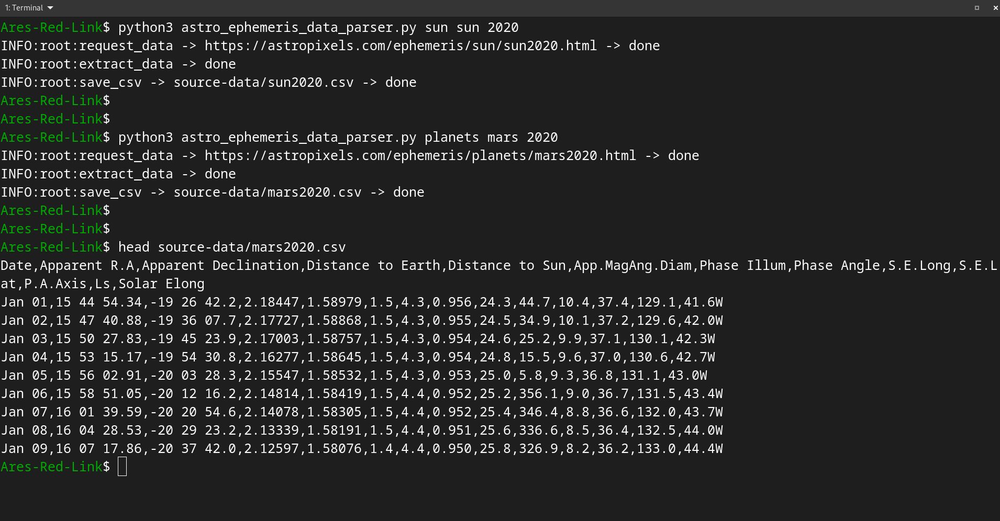
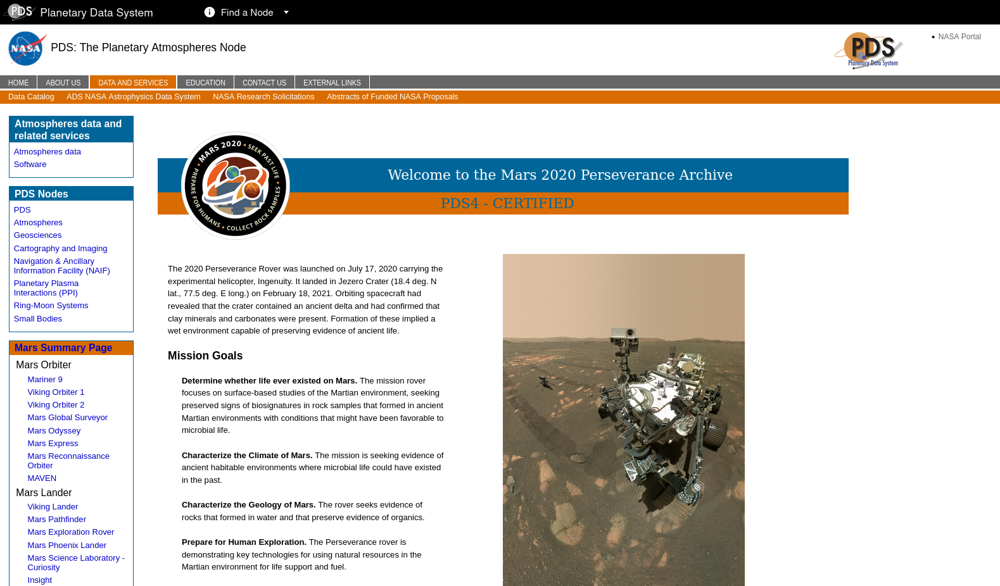
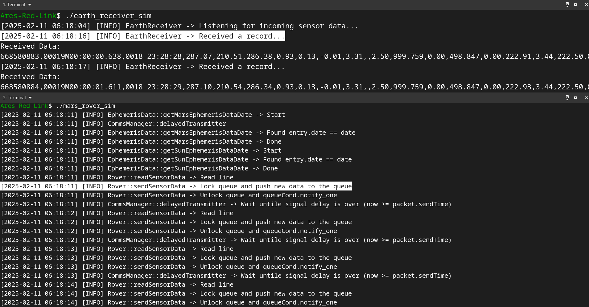

# Mars-Earth Communication 

## Data Source 


We use the ephemeris data available in the  `astropixels` website, this website has recorded historical data for planets in our solar system from 2011.

A _geocentric ephemeris_ is a table that gives the celestial coordinates of an astronomical object over a range of times as seen from Earth's center.

We will be interested in the data window between 2020 to 2024.

<br/>

## Prepare Data
Inside the root directory of the project a python script `astro_ephemeris_data_parser.py` which takes two arguments:
1. `astro_object_type`: can be planets or sun
2. `astro_object_name`: can be sun, mars, earth, .....
3. `year`, the year of which want to analyse


<br/>
<br/>

# Mars-Earth Communication of Rover Sensors Data with Signal Delay in Real-Time
Here we simulate sending data from Mars to Earth with the calculated light speed signal delay in real-time, the source sensors data frequency is each one second, and we send this data each one second too.

If a delay is `120s`, data from `T=0s` is sent at `T=120s`, data from `T=1s` is sent at `T=121s`, and so on.

## Data Source 

This data from mars is taken from The Planetary Atmospheres Node (ATM) of the Planetary Data System (PDS) https://pds-atmospheres.nmsu.edu/


<br/>

## Simulation
Two essential components are used here:
1. `UDP` communication (simulating the Mars-Earth two ends)
2. `Multi-threading` in Mars side to account for the light speed signal delay in real-time data sending

### Mars side
We send the rover sensors data here, we use the same two `EphemerisData` and `CommsManager` classes to calculate the light speed signal delay for the current day.

One more function `delayedTransmitter` is added to the `CommsManager` class to send the data with `UDP`, it runs in a separate thread and accounts for the signal delay.

```cpp
while (true) {
	std::unique_lock<std::mutex> lock(queueMutex);
	queueCond.wait(lock, [] { return !sensorsDataQueue.empty(); });
	
	if (!sensorsDataQueue.empty()) {
		DataPacket packet = sensorsDataQueue.front();
		auto now = std::chrono::steady_clock::now();		
		
		if (now >= packet.sendTime) {
			sensorsDataQueue.pop();
			lock.unlock();
			sendto(sock, packet.data.c_str(), packet.data.size(), 0, 
                   (struct sockaddr*)&serverAddr, sizeof(serverAddr));
			lock.lock();
		
		} else {
			queueCond.wait_until(lock, packet.sendTime);
		}
		
	}
}
```

It checks the queue **without blocking** and sends each packet at the exact **scheduled** time when a `queueCond.notify_one()` is called in the main flow.

<br/>


### Earth side
In `earth_receiver_sim.cpp` We receive the sent sensors data by Mars, Earth side is the `server` side here and `Mars` is the `client` side in `UDP` terminology.

<br/>

### Test run
[testrun.webm](https://github.com/user-attachments/assets/bdc7c88a-ac3f-4bec-a541-cc9a13a9df89)


If we look closely, we will find that the first pushed record to the queue is at `06:18:11` (Mars-side) and the first arrived record (Earth-side) is at `06:18:16` which is exactly after `5 seconds` (the signal delay), second record is sent at `06:18:12` and arrived at `06:18:17`, and so on......

