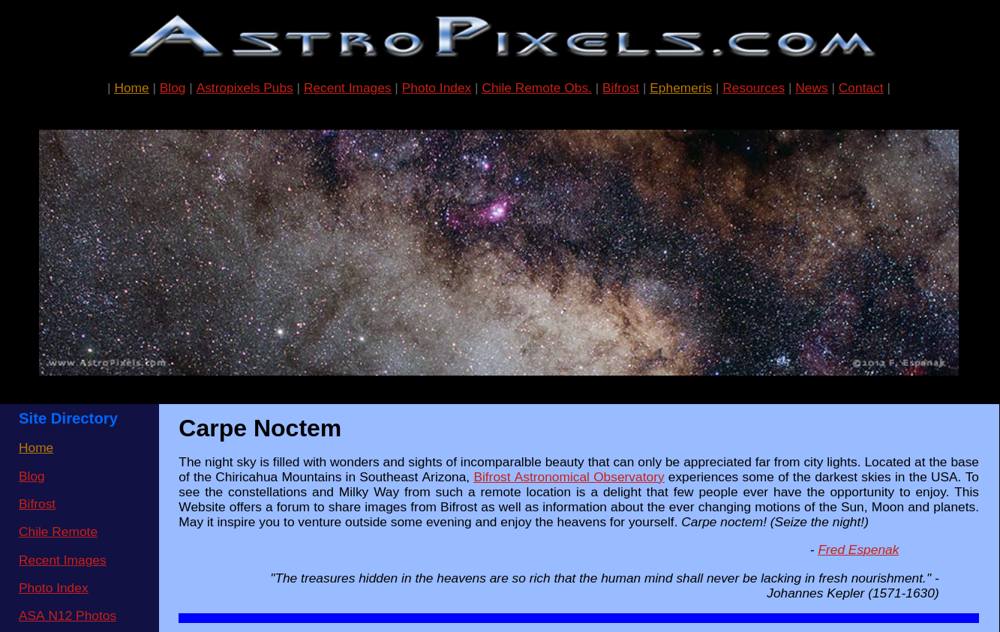

# Mars-Earth Link Analysis
In this part we investigate Mars-Earth communication link stability with respect to their relative distance with time and their coordinates with the Sun. 


## Data Source 
We use the ephemeris data available in the  `astropixels`, it has recorded historical data for planets in our solar system from 2011.

A _geocentric ephemeris_ is a table that gives the celestial coordinates of an astronomical object over a range of times as **seen from Earth's center**.

We will be interested in the data window between 2020 to 2030.

<br/>

## Prepare Data
Inside the root directory of the project a python script `astro_ephemeris_data_parser.py` which takes two arguments:
1. `astro_object_type`: can be planets or sun
2. `astro_object_name`: can be sun, mars, earth, .....
3. `year`, the year of which want to analyse

## Link Flow
The link flow is developed purely in `cpp` with a number of classes for scalability and readability.
For each year we do the following:
1. Load ephemeris data for both mars and the sun with `EphemerisData.loadEphemeris()`
2. For each record
		1. Compute 3D cartesian coordinates with `CommsManager.toCartesian()`
		2. Compute angle between the Earth-Sun and Earth-Mars vectors to check for solar conjunction with `CommsManager.computeMarsSunAngle()`
		3. Compute light speed signal delay with `CommsManager.computeSignalDelay()`
		4. Log those records with few others to `link_data.csv` for analysis


## Link Analysis
Using the logged `link_data.csv` from previous step and `link_analysis.py` python script we can now perform some analysis to answer the questions like:
1. What's the minimum and maximum signal delay values ?
2. How the signal delay varies with time ?
3. When best to communicate with Mars ?
4. How often do we lose communication and solar conjunction happens ?
5. How Mars-Sun location with respect to Earth affects conjunction ?


We can see that the `signal delay` *-first plot-* varies linearly with `distance` *-second plot-* due to the fact that their relation is `t=c/d` and `c` is constant, so when the distance between mars and earth is small, minimum delay and when the distance is big, maximum delay.

The two graphs are linear except for some places where the signal delay is very high, this is when `solar conjunction` happens *-the sun is between earth and mars blocking the signal-*, and we can confirm that with the third plot `Mars-Sun-Angle`
- **close to 0 degrees**: The Sun is between Earth and Mars (conjunction).
- **close to 180 degrees**: Mars is between Earth and the Sun (opposition).
It happens roughly every two years duo to the fact that Mars takes almost twice the time the Earth takes to make one orbit around the sun, and conjunction lasts for periods roughly two weeks.

We can also deduce the solar conjunction from the 3D cartesian coordinates plot

At the far right and left where Mars and the Sun orbits meets conjunction and opposition happens, and those two link with the above third subplot.


<br/>
<br/>

# Mars-Earth Communication of Rover Sensors Data with Signal Delay in Real-Time
In this part we simulate sending data from Mars to Earth with the calculated light speed signal delay in real-time, the source sensors data frequency is each one second, and we send this data each one second too.

If a delay is `120s`, data from `T=0s` is sent at `T=120s`, data from `T=1s` is sent at `T=121s`, and so on.

## Data Source 

This data from mars is taken from The Planetary Atmospheres Node (ATM) of the Planetary Data System (PDS) https://pds-atmospheres.nmsu.edu/


<br/>

## Simulation
Two essential components are used here:
6. `UDP` communication (simulating the Mars-Earth two ends)
7. `Multi-threading` in Mars side to account for the light speed signal delay in real-time data sending

### Mars side
We send the rover sensors data here, we use the same two `EphemerisData` and `CommsManager` classes to calculate the light speed signal delay for the current day.

One more function `delayedTransmitter` is added to the `CommsManager` class to send the data with `UDP`, it runs in a separate thread and accounts for the signal delay.

```cpp
while (true) {
	std::unique_lock<std::mutex> lock(queueMutex);
	queueCond.wait(lock, [] { return !sensorsDataQueue.empty(); });
	
	if (!sensorsDataQueue.empty()) {
		DataPacket packet = sensorsDataQueue.front();
		auto now = std::chrono::steady_clock::now();		
		
		if (now >= packet.sendTime) {
			sensorsDataQueue.pop();
			lock.unlock();
			sendto(sock, packet.data.c_str(), packet.data.size(), 0, 
                   (struct sockaddr*)&serverAddr, sizeof(serverAddr));
			lock.lock();
		
		} else {
			queueCond.wait_until(lock, packet.sendTime);
		}
		
	}
}
```

It checks the queue **without blocking** and sends each packet at the exact **scheduled** time when a `queueCond.notify_one()` is called in the main flow.

<br/>


### Earth side
In `earth_receiver_sim.cpp` We receive the sent sensors data by Mars, Earth side is the `server` side here and `Mars` is the `client` side in `UDP` terminology.

<br/>

### Test run
[testrun.webm](https://github.com/user-attachments/assets/bdc7c88a-ac3f-4bec-a541-cc9a13a9df89)


If we look closely, we will find that the first pushed record to the queue is at `06:18:11` (Mars-side) and the first arrived record (Earth-side) is at `06:18:16` which is exactly after `5 seconds` (the signal delay), second record is sent at `06:18:12` and arrived at `06:18:17`, and so on......

